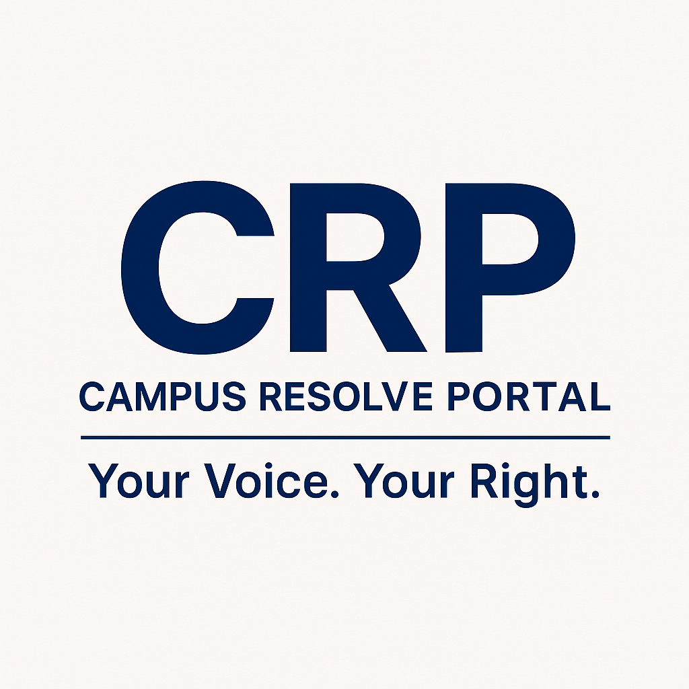

# 🏫 CRP – Campus Resolve Portal  
**Your Voice. Your Right.**

CRP is a secure and anonymous grievance redressal portal designed for college campuses. Built during the 24-hour **CODEMANIA Hackathon** at **BITS Pilani Hyderabad**, it enables students, faculty, and staff to raise issues and track their resolution without revealing identity.

---

<p align="center">
  
</p>


<p align="center">
  
  
</p>

## 🌐 Live Demo

👉 [Campus Resolve Portal - View Live](https://campus-resolve-portal-af34wp151-newp.vercel.app)

## 🚀 Features

- 📢 **Anonymous Grievance Submission**  
  Submit complaints without revealing personal information.

- 🧾 **Multi-format Input Support**  
  Raise concerns via text, voice, or even video uploads.

- 🔄 **Track Complaint Status**  
  Know when your concern is acknowledged, reviewed, and resolved.

- 🔐 **Privacy-Focused**  
  No user tracking unless voluntarily provided.

- 📊 **Admin Dashboard**  
  Campus officials can manage, review, and resolve grievances.

- 🔔 **Smart Alerts**  
  Auto-notifications at every status update.

---

## 💻 Tech Stack

Built using the **MERN** stack:

- **MongoDB** – NoSQL database for storing complaints and user data  
- **Express.js** – Web framework for Node.js  
- **React.js** – Frontend user interface  
- **Node.js** – Backend server logic

### Frontend Technologies
- **React 18** with TypeScript
- **Vite** for fast development
- **Tailwind CSS** for styling
- **Lucide React** for icons
- **React Context** for state management

### Backend Technologies
- **Node.js** with Express
- **MongoDB** with Mongoose ODM
- **JWT** for authentication
- **bcryptjs** for password hashing
- **Express-validator** for input validation
- **CORS** and **Helmet** for security

---

## 🚀 Quick Start

### Prerequisites
- Node.js (v14 or higher)
- MongoDB (local or cloud instance)
- npm or yarn

### Installation

1. **Clone the repository:**
   ```bash
   git clone <repository-url>
   cd Campus-Resolve-Portal-CRP-
   ```

2. **Install frontend dependencies:**
   ```bash
   npm install
   ```

3. **Install backend dependencies:**
   ```bash
   cd backend
   npm install
   cd ..
   ```

4. **Set up MongoDB:**
   - Install MongoDB locally, or
   - Use MongoDB Atlas (cloud)
   - Update `backend/config.env` with your MongoDB URI

5. **Start the development servers:**

   **Option 1: Use the provided script (Windows)**
   ```bash
   # Run the batch file
   start-dev.bat
   
   # Or run the PowerShell script
   .\start-dev.ps1
   ```

   **Option 2: Start manually**
   ```bash
   # Terminal 1 - Start backend
   cd backend
   npm run dev
   
   # Terminal 2 - Start frontend
   npm run dev
   ```

6. **Access the application:**
   - Frontend: http://localhost:5173
   - Backend API: http://localhost:5000
   - API Health Check: http://localhost:5000/api/health

### Default Admin Credentials
- **Email:** smallelw@gitam.in
- **Password:** Smdmnd@009

---

## 🌐 Future Scope

CRP is scalable and can be adapted for:

- 🏢 Corporate feedback and complaint systems  
- 🏛️ Government department grievance handling  
- 🏘️ Local communities and NGOs

---

## 🤝 Acknowledgements

- [TechXcelerate](https://techxcelerate.in) – Hackathon Organizer  
- [BITS Pilani Hyderabad – E-Cell](https://www.bits-pilani.ac.in/hyderabad/)  
- [BharatVersity](https://www.bharatversity.com)

---

## 📬 Contact

For questions, suggestions, or collaboration opportunities:  
📧 utkarshasalve90@gmail.com  
🔗 [LinkedIn – Utkarsha](http://www.linkedin.com/in/utkarsha-salve-253b95259/)

